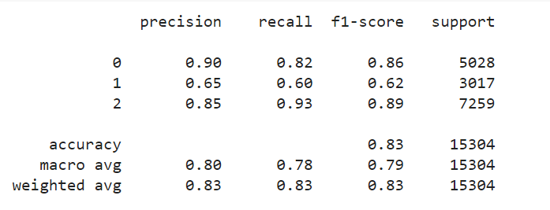
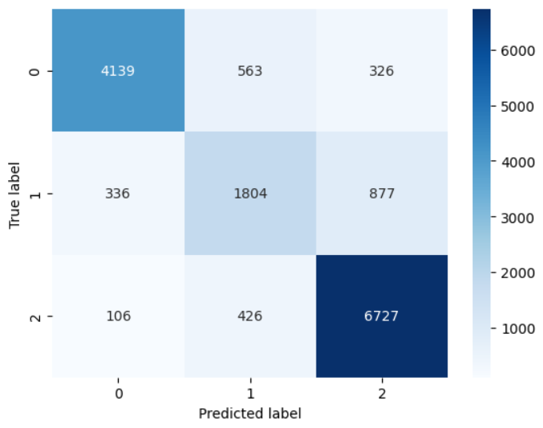

# Classification with Academic Success Datasets

This project utilizes the "Classification with Academic Success Datasets" from a Kaggle competition to predict students' academic success based on various factors. The analysis and model development were conducted using Google Colab, providing a flexible and powerful cloud-based environment for data science projects.

## Datasets

The dataset comprises several features related to students' personal, academic, and family backgrounds. It includes both numerical and categorical data.

## Methodology
The Random Forest classifier with Stratified KFold in GridSearch CV  emerged as the top-performing model, achieving an accuracy of approximately 83%. This model effectively captured the complex relationships between various features and students' academic success.

### Results

## Paper Review 
I have also review the paper "PointFusion: Deep Sensor Fusion for 3D Bounding Box Estimation", which has proposed an approach to 3D bounding box detection on Object. After analyzing the paper, I have prepared a presentation slide which you can check on the same repo.